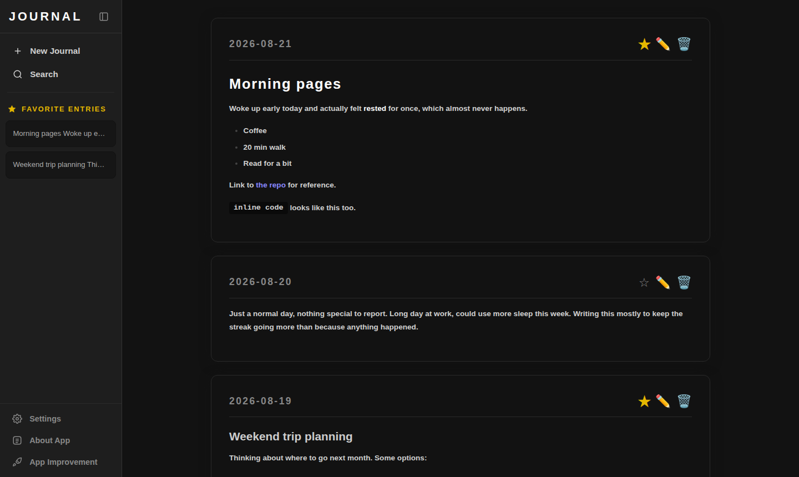

# Journal
 
A simple yet powerful local-first journaling app for fast, private note-taking using plain Markdown files — no account, no cloud, just your thoughts stored safely on your own machine.
 


## 🚀 Features

* **Markdown support** — write with formatting (headings, bold, lists, links, inline code, blockquotes) with instant live preview
* **Safe rendering** — text processing is handled by `marked.js` and `DOMPurify` libraries
* **Note organization** — create, edit, and delete entries, and star any of them as a favorite for one-click access from the sidebar
* **Search** — fast, local, full-text search across entry content and date
* **Two languages** — the interface is available in English and Czech, switchable anytime from Settings
* **Keyboard shortcuts** — create, save, and search without touching the mouse; see the full list below
* **Customization** — light or dark theme, adjustable font size, and a choice of font families, all remembered between launches
* **Non-blocking notifications** — a small toast confirms actions whose result isn't otherwise obvious (saving, deleting) and explains clearly when something fails, instead of a disruptive alert popup
* **Genuinely local** — every entry is its own plain `.md` file on your disk, in a folder you can open, and read with any other editor, no proprietary format or database involved

## 📸 First Launch
 
1. **Open the app.** On a completely fresh install you'll see an empty journal with a short prompt pointing you at the **+ New Journal** button.
2. **Write your first entry.** Click **+ New Journal** (or press `Ctrl + N`). The editor supports Markdown — try a `# heading`, some `**bold**` text, or a `- list`.
3. **Save it.** Click **Add Entry**, or press `Ctrl + S` or `Ctrl + Enter` without leaving the textbox.
4. **Star anything you want to find again.** Click the ☆ on any entry to favorite it — favorited entries show up in the **Favorite Entries** list in the sidebar, so you don't have to scroll to find them.
5. **Search when you need to.** Click the search icon or press `Ctrl + F`, then type — results filter as you type, matching both entry text and date.
6. **Make it yours.** Open **Settings** to switch between light and dark themes, adjust the font size and family, or change the interface language.
7. **Your writing never leaves your machine.** See [Where Your Entries Live](#-where-your-entries-live) below for exactly where to find the files.

## ⌨️ Keyboard Shortcuts
 
| Shortcut | Action |
|---|---|
| `Ctrl + N` | New entry |
| `Ctrl + F` | Search |
| `Ctrl + S` or `Ctrl + Enter` | Save the entry you're writing |
| `Esc` | Close the open dialog |
 
This same list is always available inside the app under **Settings → Keyboard Shortcuts**. Shortcuts that open something (new entry, search, settings) intentionally do nothing while another dialog is already open, so they can't interrupt something you're in the middle of writing.

## 🗂 Where Your Entries Live
 
Every entry is saved as its own Markdown file — nothing is bundled into a database or a proprietary format. Each file starts with a short metadata header (filename, creation date, updated_at date, favorite flag) followed by your entry text exactly as you wrote it:
 
```
---
filename: 2026-08-21_aB3dE9fG2h.md
date: 2026-08-21
updated_at: 18:05
favorite: false
---
Your entry text goes here, exactly as written.
```
 
These files live in a `notes` folder inside the operating system's standard per-app data directory — the same place any well-behaved desktop app stores its files, not somewhere hidden or unusual. The exact path depends on your OS and the app's configured identifier, but it follows this pattern:
 
* **Windows:** `%APPDATA%\<app identifier>\notes\`
* **macOS:** `~/Library/Application Support/<app identifier>/notes/`
* **Linux:** `~/.config/<app identifier>/notes/`

Because it's just a folder of plain text files, you can back it up, sync it with your own tool of choice, read it with any text editor, or move it to a new machine — all without this app.

## 🛠 Technology
 
* **Frontend:** vanilla JavaScript (ES modules), HTML, CSS — no framework, no build step required for the frontend itself
* **Backend:** Rust, via [Tauri](https://tauri.app/)
* **Markdown & sanitization:** [`marked`](https://github.com/markedjs/marked) and [`DOMPurify`](https://github.com/cure53/DOMPurify), loaded at pinned versions


## 📥 Download and Installation

You can download the latest version of the application directly from the [Releases](https://github.com/AdamVagi/note_app/releases/latest) page:

* **Windows:** `.exe` or `.msi`
* **macOS:** `.dmg` or `.app`
* **Linux:** `.deb` or `.AppImage

## ⚙️ Developer Launch
 
You'll need the Rust and Tauri toolchains installed first (see the [Tauri prerequisites guide](https://tauri.app/start/prerequisites/) for your platform). Then:
 
```bash
# Clone the repository
git clone https://github.com/AdamVagi/note_app.git
cd note_app
 
# Install frontend dependencies
npm install
 
# Run the application in dev mode
npm run tauri dev
```
 
To produce a release build and installer for your own platform:
 
```bash
npm run tauri build
```
 
## 🔒 Privacy
 
There's no account, no telemetry, and no cloud sync — the app doesn't talk to a server for anything except two things you trigger yourself: rendering Markdown/sanitization libraries loaded once from a CDN on startup, and submitting the in-app feedback form if you choose to use it. Your entries never leave your machine unless you move them there yourself.
 
## 📄 License
 
MIT License — see [`LICENSE`](LICENSE) for the full text.
 
## 💬 Feedback & Contributing
 
Found a bug or have an idea? Use **App Improvement** inside the app to send feedback directly, or open an [issue](https://github.com/AdamVagi/note_app/issues) on GitHub. Pull requests are welcome — please open an issue first for anything beyond a small fix, so i can talk through the approach before you put the work in.
 
---